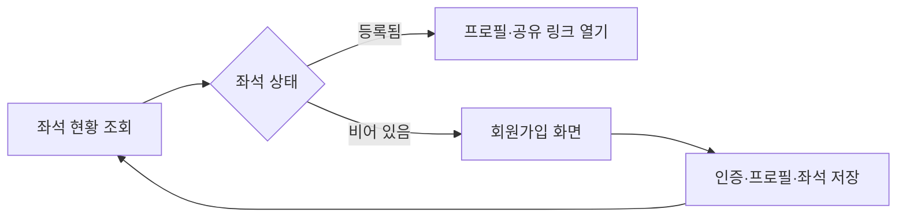

# Fryiing (후라이잉)

코호트 구성원이 좌석을 고르고 자기소개와 공유 링크를 등록하는 좌석형 프로필 디렉터리입니다. 4명이 함께 만든 팀 프로젝트로, 빈 좌석에서 가입을 시작하고 등록된 좌석을 누르면 구성원이 공유한 페이지로 이동합니다.

> 이 저장소는 2025년 팀 프로젝트를 포트폴리오용으로 보존한 버전입니다. [공개 데모](https://fryiing.vercel.app)는 기존 화면 탐색용이며, 새로운 개인정보가 쌓이지 않도록 회원가입을 기본적으로 꺼 두었습니다.

## 핵심 흐름



- 30개 좌석을 한눈에 확인하는 반응형 좌석표
- 이메일 기반 Supabase 인증과 세션 동기화
- 닉네임, 소개, 프로필 이미지, 공유 URL 등록 및 수정
- 등록된 좌석에서 외부 공유 페이지로 이동
- 로딩·오류 상태, 키보드 조작, 안전한 외부 링크 처리

현재 좌석 데이터는 페이지 진입 시 한 번 조회합니다. Supabase Realtime 구독은 구현하지 않았기 때문에 이 프로젝트를 실시간 예약 시스템으로 설명하지 않습니다.

## 제가 담당한 부분

커밋 이력을 기준으로 다음 영역을 주도적으로 구현하고 안정화했습니다.

- Next.js와 Supabase 기반 프로젝트 구조 및 초기 연동
- 좌석 그리드와 빈 좌석 → 회원가입 흐름
- 인증 세션, 프로필 이미지 업로드, `userInfo` 저장·수정
- 프로필 편집 화면과 배포·빌드 오류 정리
- 공개 포트폴리오 전환 과정의 접근성·세션·보안 보강

전체 팀원은 김준엽, 손민준, 최준호, 김현영이며, 저장소의 [Contributors](https://github.com/0xMegg/team2/graphs/contributors)에서 공동 작업 내역을 확인할 수 있습니다.

## 기술 구성

- Next.js 16, React 19, TypeScript, Tailwind CSS 4
- Supabase Auth, PostgreSQL, Storage
- Zustand, React Hook Form, Zod, Radix UI
- Vercel, GitHub Actions

포트폴리오 정리 과정에서 Next.js 16으로 올리고, Supabase 세션을 별도 로컬 저장소에 중복 보관하던 구조를 제거했습니다. 신규 등록은 `NEXT_PUBLIC_ENABLE_SIGN_UP=true`일 때만 허용하며, 공유 URL은 `http`와 `https`만 열 수 있습니다.

## 로컬 실행

Node.js 22 이상이 필요합니다.

```bash
git clone https://github.com/0xMegg/team2.git
cd team2
npm ci
cp .env.example .env.local
npm run dev
```

자체 Supabase 프로젝트의 공개 URL과 anon key를 `.env.local`에 넣어야 합니다. 전체 기능을 재현하려면 Auth, Storage, RLS가 적용된 `userInfo` 테이블도 별도로 구성해야 하며, 운영 데이터베이스 스키마와 정책은 이 저장소에 포함되어 있지 않습니다.

## 검증

```bash
npm run lint
npm run typecheck
npm run build
npm audit --audit-level=high
```

GitHub Actions가 같은 검사를 pull request와 `main` 브랜치에서 수행합니다.

## 한계와 다음 단계

- 외부 Supabase 프로젝트에 의존해 별도 백엔드 구성 없이는 데이터 기능을 재현할 수 없습니다.
- 좌석 변경을 실시간 구독하지 않으므로 새로고침 전에는 다른 사용자의 변경이 반영되지 않습니다.
- 자동화된 브라우저 시나리오 테스트는 아직 없습니다.
- 현재 공개 배포는 보존용 데모이며 신규 회원가입을 받지 않습니다.
